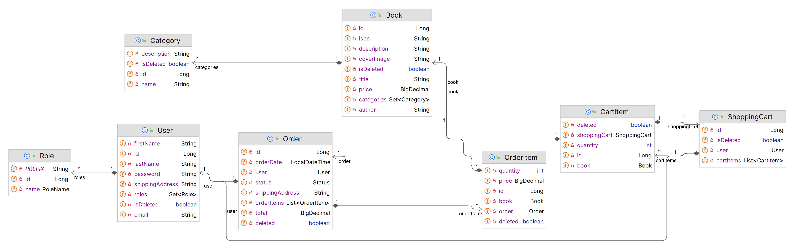

# 📚 Book Store API
**BookStore** is a backend **REST API** developed as a **pet project** during my studies at **Mate Academy**. The project simulates the core functionality of an online bookstore and demonstrates modern backend development practices using **Java** and **Spring Boot**.

Users can register, explore the book catalog, add books to their shopping cart, and place orders. Administrators have the ability to manage books, categories, and orders, ensuring efficient store management.

---
## 🚀 Key Features
* **Full CRUD functionality**.
* **Role-based access** for users (**User**) and administrators (**Admin**).
* **Secure authentication** and authorization with **JWT tokens**.
* **Modern tech stack** based on Spring Boot.
* **API documentation** using Swagger/OpenAPI.

---
## 🛠️ Technologies and Tools

### Backend
- Java 17
- Spring Boot
- Spring Web
- Spring Data JPA
- Spring Security
- Hibernate

### Database
- MySQL

### Security
- JWT Token

### Database Migration
- Liquibase

### Testing
- Spring Test
- JUnit
- Mockito
- TestContainers

### Documentation
- Swagger / OpenAPI

### Tools
- Maven
- Lombok
- MapStruct
- Postman
- Docker

---

## 📌 Main Entities Structure


---
## 📦 Functionality

BookStore provides core functionality for an online bookstore and supports role-based access for both **customers** and **administrators**.

### 👱‍♂️ For Users

| Feature              | Description                                           |
| -------------------- | ----------------------------------------------------- |
| 🔐 Register & Login  | Create an account and log in to the system            |
| 📚 Browse Books      | View all books or detailed info about a specific book |
| 🗂 Browse Categories | View all categories and the books in them             |
| 🛒 Shopping Cart     | Add, view, and remove books from the cart             |
| 💳 Checkout          | Purchase all books in the cart                        |
| 📜 Order History     | View your order history                               |
| 📦 Order Details     | View the contents of a specific order                 |

### 🛠 For Admins

| Feature              | Description                                               |
| -------------------- | --------------------------------------------------------- |
| ➕ Add Book           | Add a new book to the store                               |
| ✏️ Edit Book         | Update book details like title, description, price, etc.  |
| ❌ Delete Book        | Remove a book from the catalog                            |
| 🗂 Manage Categories | Create, update, and delete categories                     |
| 📋 Manage Orders     | Change order status (`PENDING`, `COMPLETED`, `DELIVERED`) |

---
## 🧩Main Features by Controller
Access to REST endpoints is restricted based on user roles. Authorization is handled via **JWT tokens**. After a successful login, a JWT token is issued and must be included in the request header as `Authorization: Bearer <token>` for all protected endpoints.

### 📘 BookController
| Endpoint | Method | Access | Description |
| --- | --- | --- | --- |
| /books | GET | All | Retrieve all books (paginated) |
| /books/search | GET | USER | Search by title, author, or ISBN |
| /books/{id} | GET | USER | Retrieve a book by ID |
| /books | POST | ADMIN | Create a new book |
| /books/{id} | PUT | ADMIN | Update an existing book |
| /books/{id} | DELETE | ADMIN | Delete a book |

### 📂 CategoryController
| Endpoint | Method | Access | Description |
| --- | --- | --- | --- |
| /categories | GET | USER | Retrieve all categories |
| /categories/{id} | GET | USER | Retrieve a specific category |
| /categories/{id}/books | GET | USER | Retrieve books in category |
| /categories | POST | ADMIN | Create a new category |
| /categories/{id} | PUT | ADMIN | Update a category |
| /categories/{id} | DELETE | ADMIN | Delete a category |

### 🛒 ShoppingCartController
| Endpoint | Method | Access | Description |
| --- | --- | --- | --- |
| /cart | GET | USER | Get current user’s shopping cart |
| /cart | POST | USER | Add a book to the cart |
| /cart/items/{cartItemId} | PUT | USER | Update item quantity |
| /cart/items/{cartItemId} | DELETE | USER | Remove item from cart |

### 📦 OrderController
| Endpoint | Method | Access | Description |
| --- | --- | --- | --- |
| /orders | POST | USER | Create an order from the current user’s cart |
| /orders | GET | USER | Retrieve all orders of the current user |
| /orders/{id} | PATCH | ADMIN | Update order status |
| /orders/{orderId}/items | GET | USER | Get all items in the order |
| /orders/{orderId}/items/{itemId} | GET | USER | Get a specific order item |

### 👱‍♂️ AuthController
| Endpoint | Method | Description |
| --- | --- | --- |
| /auth/registration | POST | Register a new user |
| /auth/login | POST | Authenticate and retrieve JWT |

---
### 📖 Swagger API Documentation

The BookStore project includes interactive API documentation powered by **Swagger (OpenAPI 3)**.

Once the application is running, you can access the Swagger UI in your browser at:

[http://localhost:8080/api/swagger-ui/index.html](http://localhost:8080/api/swagger-ui/index.html)

---
## 🚀 Running the Project Locally

To run BookStore locally, you can use **Docker Compose** – the easiest way to automatically configure both the app and the database.

### 📝 Requirements

- **Java 17+ JDK** (`java -version`, `javac -version`)  
- **Docker & Docker Compose**

### 1. Clone the Repository

```bash
git clone https://github.com/nastasiiaKulinich/book-store
cd BookStore
```

### 2. Environment Configuration

Before running the project, you need to configure environment variables.  
Create a `.env` file in the project root based on the example below:

```env
# === MySQL Configuration ===
MYSQL_ROOT_PASSWORD=root
MYSQL_DATABASE=bookstore
MYSQL_USER=bookstore_user
MYSQL_PASSWORD=secret

MYSQL_LOCAL_PORT=3307
MYSQL_DOCKER_PORT=3306

# === Spring Boot App Ports ===
SPRING_LOCAL_PORT=8080
SPRING_DOCKER_PORT=8081

# === Debugging ===
DEBUG_PORT=5005

# === JWT Configuration ===
JWT_SECRET=my-super-secret-key
JWT_EXPIRATION_TIME=86400000
````

### 3. Run the App with Docker Compose

Navigate to the project root directory (where the `docker-compose.yml` file is located) and run:

```bash
docker-compose up --build
```

### 4. Stopping the App

To stop the running containers, press `Ctrl+C` in the terminal, then run:

```bash
docker-compose down
```

---
## 📧 Contact

* **Author:** Anastasiia Kulinich
* **GitHub:** [https://github.com/nastasiiaKulinich](https://github.com/nastasiiaKulinich)
* **E-mail:** kulinichanastasiiaa@gmail.com
